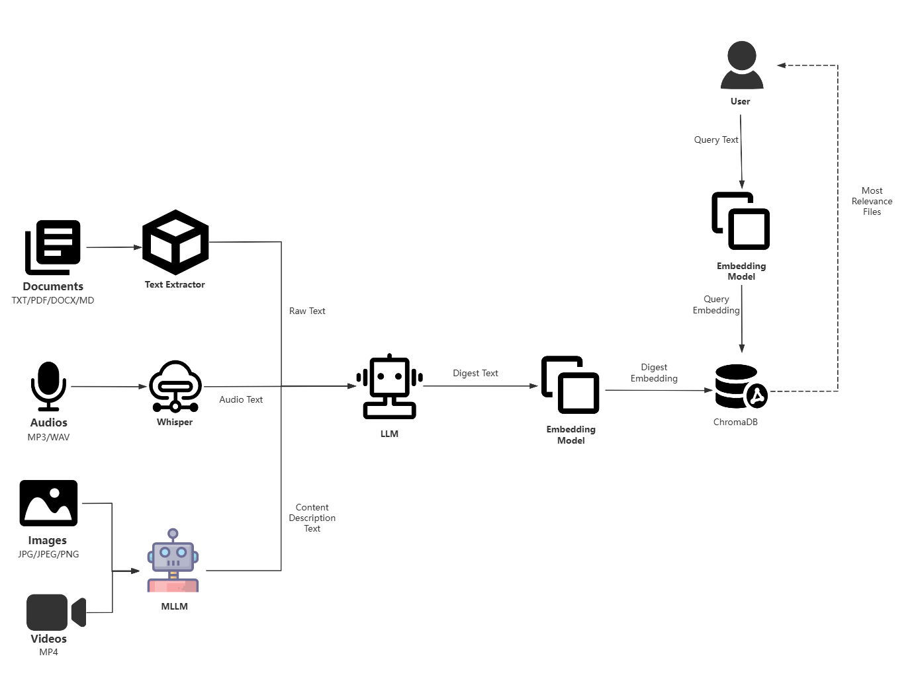

# semantic-file-retrieval
A lightweight semantic file retrieval application based on LLM and vector db.

[中文版README](README.md)

## Architecture


## Demo
https://github.com/user-attachments/assets/f1590c6f-5d5c-44c6-8370-591ed66e7452

## Quick Start
1. Install Dependencies
```bash
pip install -r requirements.txt
```

2. Config your OLLAMA_BASE_URL or GLM_API_KEY in local .env file


3. Run the project
```bash
streamlit run main.py
```
## Docker Deployment
1. Build the docker image
```bash
docker build -t semantic-file-retrieval:latest .
```

2. Run the docker container
```bash
docker run -d -e OLLAMA_BASE_URL="http://x.x.x.x:11434" -p 8501:8501 semantic-file-retrieval:latest
```
> _All the environment variables in .env file can be overridden by docker run command_

## TODO
- [ ] Support audios
- [ ] Support videos
- [ ] Support parsing scanned pdf 
- [ ] Support office documents
- [ ] Support retrieve image by image
- [ ] Support batch uploading(upload folders) 
- [ ] Provide restful APIs for customized integration
- [ ] Support offline processing for large files
- [ ] Support filtering retrieving results by file type
- [ ] Support traditional file retrival(querying by keywords)
